# Obsidian Compact UI Component

  

I wrote this CSS snippet a few years ago to make Obsidian feel a little more compact. It tightens up the extra spacing around text and UI elements, so you can see more of your notes at once without changing how Obsidian works.

It works on a clean Obsidian install with no plugins or themes required. If you do use themes, it also pairs nicely with the [Things theme](https://github.com/colineckert/obsidian-things), which is one of my favorites. Enjoy!

  

## Preview

### Before (Original Obsidian Style)

### After (After Added My Custom Style)

## Snippet Effects

Regular snippets live in `snippets/`. Each one can be enabled on its own, and demos with screenshots show the change from a clean Obsidian view to the snippet-enabled view.

### [Root](snippets/root.css)

Shared color variables used by the other snippets.

### [Active Row](snippets/active-row.css)

| Before | After |
| --- | --- |
| 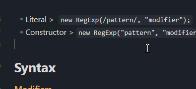 | 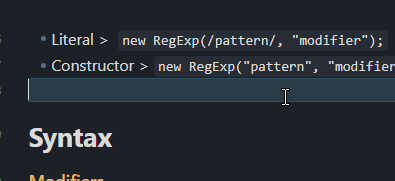 |

### [Compact Source View](snippets/compact-source-view.css)

Tightens source mode and live preview spacing.

### [Diamond Bullet List](snippets/diamond-bullet-list.css)

| Before | After |
| --- | --- |
| 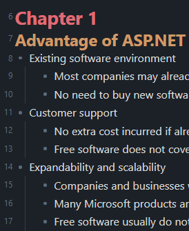 | 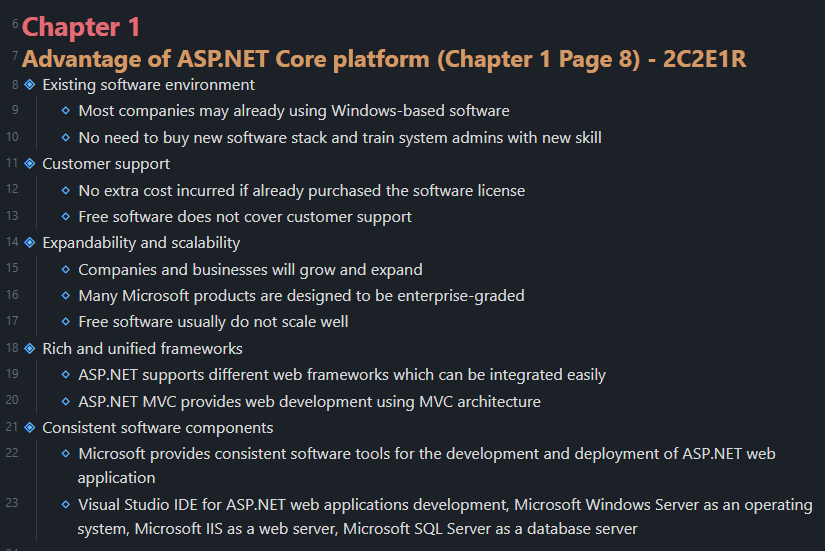 |

### [Heading Colors](snippets/heading-colors.css)

| Before | After |
| --- | --- |
| 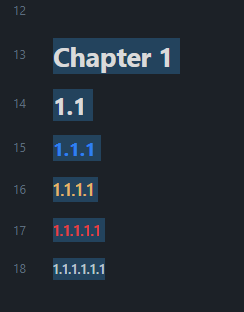 | 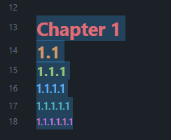 |

### [Inline Code](snippets/inline-code.css)

| Before | After |
| --- | --- |
| 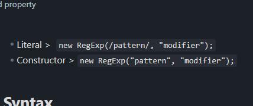 | 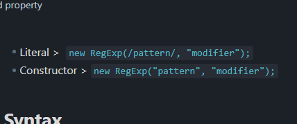 |

### [Outline Colors](snippets/outline-colors.css)

| Before | After |
| --- | --- |
|  | 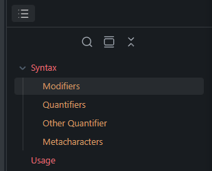 |

### [Outline Spacing](snippets/outline-spacing.css)

| Before | After |
| --- | --- |
| 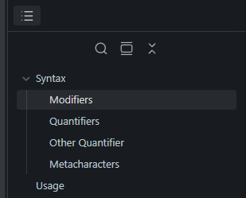 | 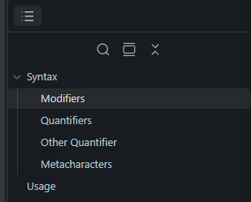 |

### [Popover Preview](snippets/popover-preview.css)

Adjusts hover preview popover sizing and padding.

### [Print View](snippets/print-view.css)

Applies print-only list and link styling.

### [Reading Mode Spacing](snippets/reading-mode-spacing.css)

| Before | After |
| --- | --- |
| 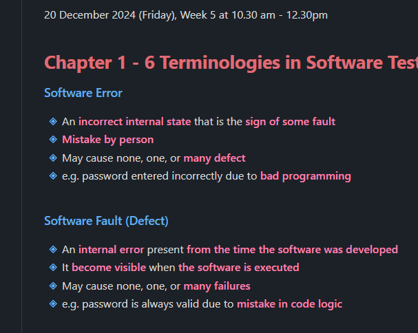 | 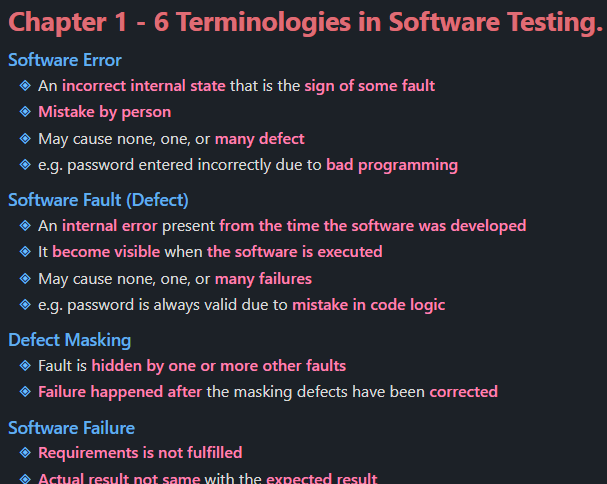 |

### [Scrollbar](snippets/scrollbar.css)

| Before | After |
| --- | --- |
| 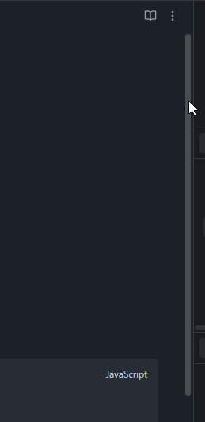 | 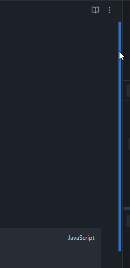 |

### [Sidebar Active Note](snippets/sidebar-active-note.css)

| Before | After |
| --- | --- |
| 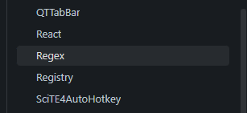 | 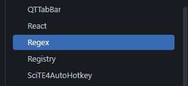 |

### [Table Styles](snippets/table-styles.css)

| Before | After |
| --- | --- |
| 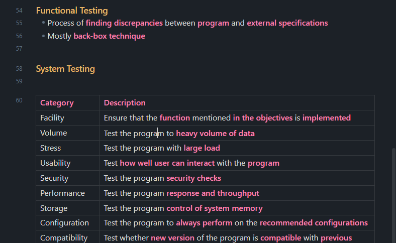 | 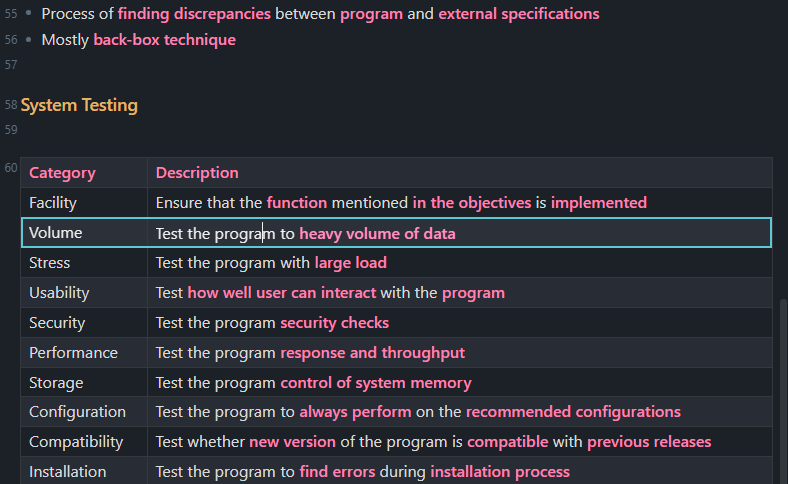 |

## Optional Snippets

Optional snippets live in `optional-snippets/`. These are stronger visual tweaks that you can enable only when you want the extra effect.

### [Animation Background](optional-snippets/animation-background.css)

Optional background image and overlay rules.

### [Animation Title](optional-snippets/animation-title.css)

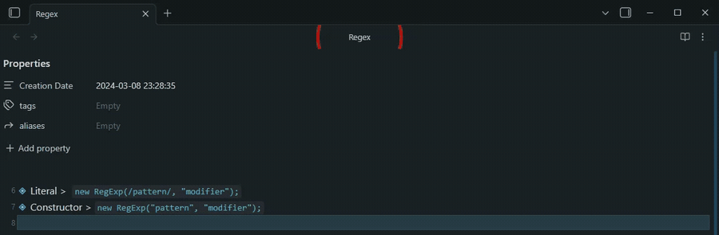

### [Hide Left Sidebar](optional-snippets/hide-left-sidebar.css)

Hides the collapsed left sidebar ribbon.

### [Icon Animation](optional-snippets/icon-animation.css)

Optional icon animation rules.

### [Minecraft Cursor](optional-snippets/minecraft-cursor.css)

Optional custom cursor rule.
