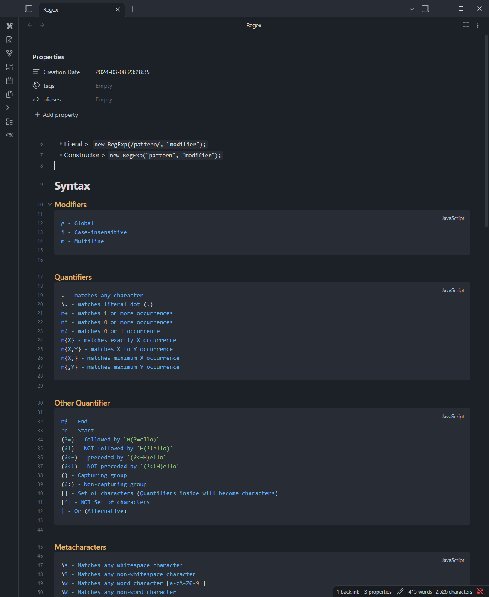
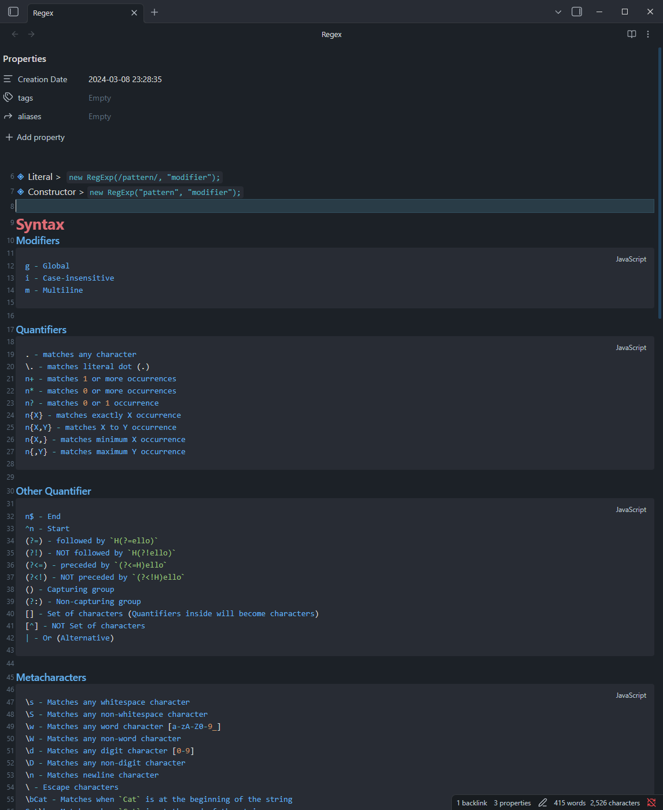

# Obsidian Compact UI Component

  

I wrote this CSS snippet a few years ago to make Obsidian feel a little more compact. It tightens up the extra spacing around text and UI elements, so you can see more of your notes at once without changing how Obsidian works.

It works on a clean Obsidian install with no plugins or themes required. If you do use themes, it also pairs nicely with the [Things theme](https://github.com/colineckert/obsidian-things), which is one of my favorites. Enjoy!

  

## Preview

### Before (Original Obsidian Style)

### After (After Added My Custom Style)

